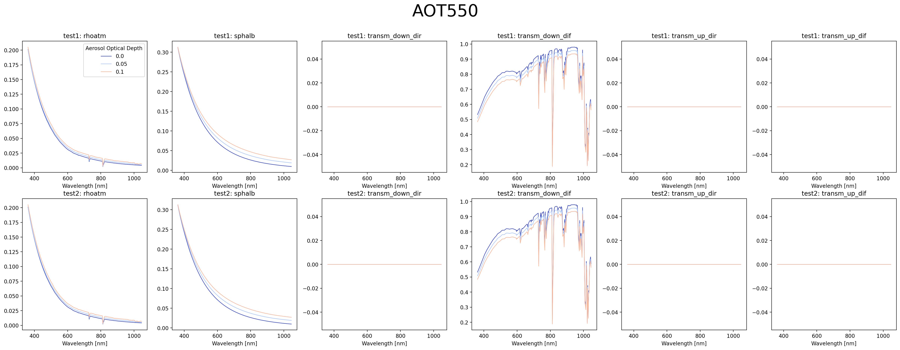
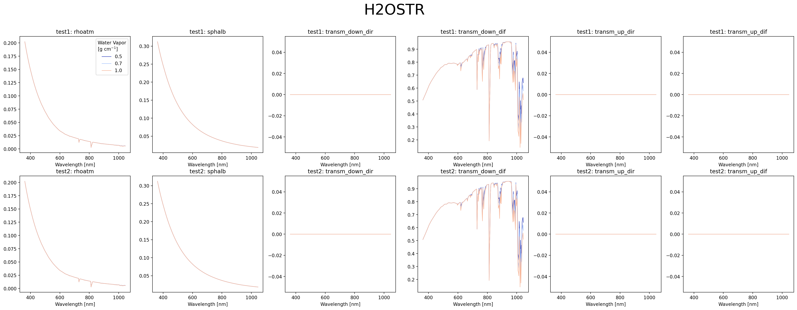

Plots the quantities of a look up table (LUT) of radiative transfer models (RTMs).

Can plot up to two LUTs at once for easy side-by-side comparison.

Usage
--

```
Usage: isoplots rtms [OPTIONS] FILE

  Plots RTMs

  Parameters
  ----------
  file : str
      Path to the input LUT NetCDF
  compare : str, default=None
      Secondary LUT NetCDF to compare with
  variables : list[str], default=['rhoatm', 'sphalb', 'transm_down_dir', 'transm_down_dif', 'transm_up_dir', 'transm_up_dif']
      LUT variables to plot
  input_name : str, default="Input"
      Name to assign for the input LUT
  compare_name : str, default="Compare"
      Name to assign for the comparison LUT
  output : str, default=None
      Path to output directory to save plots to
  terminal : bool, default=False
      Converts the matplotlib figure to plotext to be plotted into a terminal

Options:
  -c, --compare TEXT
  -v, --variables TEXT
  -in, --input-name TEXT
  -cn, --compare-name TEXT
  -o, --output TEXT
  -t, --terminal
  --help                    Show this message and exit.
```

Examples
--

To generate the below examples, first build and execute the isofit `SantaMonica` example:
```
$ isofit download all
$ isofit build
$ ./$(isofit path examples)/20151026_SantaMonica/run.sh
```

Then create plots comparing the `D8p5W_6s` LUT to `D9p5W_6s`:

```
$ isoplots rtms $(isofit path examples)/20151026_SantaMonica/lut/D8p5W_6s.nc -c $(isofit path examples)/20151026_SantaMonica/lut/D9p5W_6s.nc -in test1 -cn test2 -o test
Plotting RTMs
Loading 20151026_SantaMonica/lut/D8p5W_6s.nc
Detected NaNs in the following LUT variable and may cause issues: thermal_upwelling
Detected NaNs in the following LUT variable and may cause issues: thermal_downwelling
Loading examples/20151026_SantaMonica/lut/D9p5W_6s.nc
Detected NaNs in the following LUT variable and may cause issues: thermal_upwelling
Detected NaNs in the following LUT variable and may cause issues: thermal_downwelling
Wrote to: test/AOT550.png
Wrote to: test/H2OSTR.png
Finished
```




